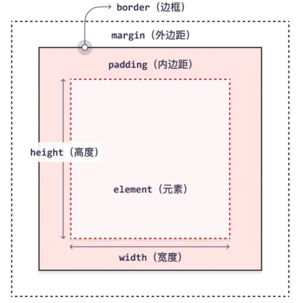

`CSS`是`Cascading Style Sheets`的缩写，即层叠样式表，用于描述网页外观，比如颜色、字体、边框等等。

## CSS 语法

`CSS`通常用`选择器`和`属性`来定义样式。选择器用于选择HTML元素，属性用于定义样式。语法规则如下：
```css
选择器 {
    属性1: 值1;
    属性2: 值2;
}
```
例如，给所有`<p>`元素设置颜色为红色，字体大小为16px：
```css
p {
    color: red;
    font-size: 16px;
}
```

## CSS 选择器
CSS 选择器用于选择HTML元素，大致可以分为以下几种：
* `基本选择器`：包含元素选择器，类选择器，ID选择器，通用选择器
* `组合选择器`：包含后代选择器，子选择器，相邻元素选择器
* `伪类选择器`：包含伪类选择器，伪元素选择器

> 优先级：`ID` > `类` > `标签` 

### 元素选择器
元素选择器用于选择所有指定的HTML元素，如`div`、`p`、`a`等。
```css
h1 {
    color: blue;
    font-size: 26px;
}
```

### 类选择器
类选择器用于选择所有指定类名的HTML元素，如`class="title"`、`class="paragraph"`、`class="link"`等，类名前面加`.`用于指定类选择器。
```css
.link {
    color: blue;
    font-size: 16px;
    font-style: italic; /* 斜体 */
}
```

### ID选择器
ID选择器用于选择所有指定ID的HTML元素，如`id="title"`、`id="paragraph"`、`id="link"`等，ID名前面加`#`用于指定ID选择器。
```css
#title {
    color: red;
    font-size: 24px;
    font-weight: bold; /* 加粗 */
}
```

### 通用选择器
通用选择器用于选择所有HTML元素，用`*`表示。
```css
* {
    font-family: "KaiTi";
}
```

### 子元素选择器
子元素选择器用于选择父元素的子元素，如`div`元素下的第一级`p`元素，用`>`表示。
例如对所有`page`类下面的`p`元素进行样式设置：
```html
<div class="page">
    <p>这是一个段落</p>
    <div>
        <p>这是另外一个段落</p>
    </div>
</div>
```
```css
.page > p {
    font-size: 16px;
}
```
:::note[注意]
对于上述的样式设置，`p`元素会被选中，`div`元素下的`p`元素不会被选中。因为`div`里面的元素不是`page`类的直接子元素，所以`div`元素下的`p`元素不会被选中。
:::

### 后代选择器
后代选择器用于选择父元素下的所有子元素，如`div`元素下的所有元素。
```css
.page  p { 
    font-size: 16px;
}
```
样式设置会作用在`div`元素下的所有`p`元素，包括内部`div`元素下的`p`元素。

### 相邻元素选择器
相邻元素选择器用于选择相邻的下一个元素，如和`h2`元素相邻`p`元素，使用`+`符号。
```html
<p>这是第一个段落</p>
<h2>标题</h2>
<p>这是第二个段落</p>
```
```css
h2 + p { 
    font-size: 20px;
    color: red;
}
```
样式设置会作用在`h2`元素后面的第一个`p`元素，即第二个段落。

### 伪类选择器
伪类选择器用于满足用户交互，选择某些特殊状态的元素，如鼠标悬停、鼠标按下、鼠标聚焦等。
```css
#link:hover { 
    background-color: yellow;
}
```
`#link:hover`选择器会选择id为`link`的元素，当鼠标悬停在该元素上时，会改变其背景颜色。
常用的伪类选择器有如下几种：
* `:hover`：鼠标悬停
* `:active`：鼠标按下
* `:focus`：鼠标聚焦
* `:link`：未访问的链接
* `:visited`：已访问的链接
* `:fist-child`：父元素的第一个子元素
* `:last-child`：父元素的最后一个子元素
* `:nth-child(n)`：父元素的第n个子元素

### 伪元素选择器
用于选择特殊的元素，常见的伪元素有：
* `::before`：在元素内容之前插入内容
* `::after`：在元素内容之后插入内容
* `::first-line`：选择元素的第一行
* `::first-letter`：选择元素中的第一个字母
* `::selection`：选择用户正在选择的内容

## CSS 属性


### CSS 框模型

所有 HTML 元素都可以视为方框，CSS 框模型实质上是一个包围每个 HTML 元素的框。它包括：外边距、边框、内边距以及实际的内容，如上图所示。

| 属性 | 简介 |
| --- | --- |
|内容（Content）| 盒子包含的实际内容，比如文本、图片等|
|内边距（Padding）| 盒子的内部边距，即内容到边框的间隔，使用 `padding` 属性设置|
|边框（Border）| 盒子的边框，使用 `border` 属性设置|
|外边距（Margin）| 盒子的外部边距，即盒子到其他盒子之间的间隔，使用 `margin` 属性设置|

### 颜色
* `color`：设置文本颜色
* `background-color`：设置背景颜色

### 定位

### 浮动


## CSS的导入方式

### 内联样式（Inline Styles）
直接在HTML元素的 `style` 属性中定义CSS：
```html
<p style="color: red; font-size: 16px;">这是一段文本</p>
```

### 内部样式表（Internal Stylesheet）

在HTML文档的 `<head>` 部分使用 `<style>` 标签定义CSS：
```html
<head>
    <style>
        body {
        background-color: blue;
        }
    </style>
</head>
```

### 外部样式表（External Stylesheet）
在HTML文档的 `<head>` 部分使用 `<link>` 标签导入CSS文件：
```html
<head>
    <link rel="stylesheet" href="style.css">
</head>
```

:::note[注意]
导入方式的优先级：`内联样式表` > `内部样式表` > `外部样式表`
:::

### @import 规则
在CSS文件中使用 `@import` 规则导入外部样式表：
```css
@import url('other-styles.css');
@import 'another-styles.css';
```

