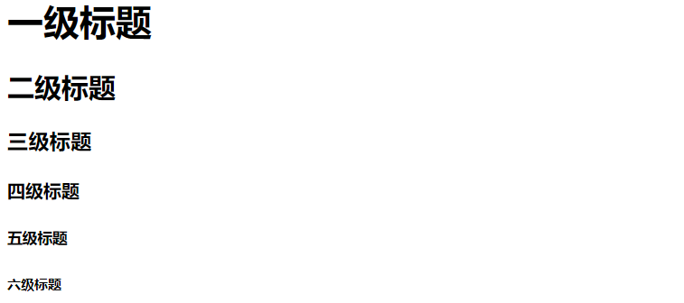
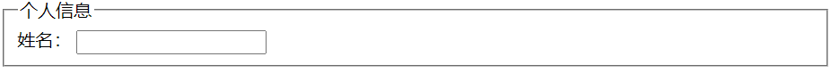

`HTML` 全称是 `HyperText Markup Language（超文本标记语言）`，通过标签来界定不同类型的文本。

## HTML 文件结构
下面是一个简单的HTML文件：
```html
<!DOCTYPE html>
<html>
    <head>
        <!-- 文档元信息 -->
        <meta charset="utf-8">
        <title>HTML</title>
        <!-- 引入外部样式表 -->
        <link rel="stylesheet" type="text/css" href="style.css">
    </head>
    <body>
        <!-- 页面具体内容 -->
        <h1>这是一个标题</h1>
        <p>这是一个段落</p>
        <a href="https:://motues.top">这是一个超链接</a>
        <!-- 引入脚本文件 -->
        <script src="script.js"></script>
    </body>
</html>
```

第一行的 `<!DOCTYPE html>` 用来表示这是一个HTML文档，`<html></html>` 用来定义HTML文档的具体内容。  
`<head></head>` 用来定义HTML文档的头部，里面可以放置一些元数据，比如标题、样式表、脚本文件等等。  
`<body></body>` 用来定义HTML文档的主体，里面可以放置一些内容，比如标题、段落、超链接等等，一般页面的主体内容都放在这个区域。

## HTML 标签
标签分为双标签和单标签，双标签用于包含内容的文本，单标签用于不含内容的文本。
* **双标签**
    比如段落标签`<p></p>`，链接标签`<a></a>`，双标签直接按可以直接插入文本等信息。
    ```html
    <p>这是段落</p>
    <a href="https://www.baidu.com">百度一下</a>
    ```
* **单标签**
    比如输入标签`<input>`，换行标签`<br>`，图片标签``等等。

### 头部标签
HTML的头部标签有`<h1>`到`<h6>`，分别对应六级标题。
```html
<h1>一级标题</h1>
<h2>二级标题</h2>
<h3>三级标题</h3>
<h4>四级标题</h4>
<h5>五级标题</h5>
<h6>六级标题</h6>
```
效果如下：


### 文本样式标签
* `<b>` - 粗体文本  
    `<strong>` - 重要内容（通常也显示为粗体）
* `<i>` - 斜体文本  
    `<em>` - 强调文本（通常也显示为斜体）
* `<u>` - 下划线文本  
    `<ins>` - 插入文本（通常显示为下划线）
* `<s>` - 删除线文本  
    `<del>` - 删除文本（通常显示为删除线）

效果如下：  
<b>粗体文本</b>，<<i>斜体文本</i>， <u>下划线文本</u>， <del>删除文本</del>

### 上下标标签
* `<sub>` - 下标文本
* `<sup>` - 上标文本

### 列表标签
* `<ul>` - 无序列表  
* `<ol>` - 有序列表

列表要搭配`<li>`标签使用，如：
```html
<ul>
    <li>列表项1</li>
    <li>列表项2</li>
</ul>
```

### 表格标签
* `<table>` - 表格标签
* `<tr>` - 表格行标签（table row）
* `<td>` - 表格列标签（table data）
* `<th>` - 表格表头标签（table header）

使用示例如下
```html
<table>
    <tr>
        <th>姓名</th>
        <th>年龄</th>
        <th>城市</th>
    </tr>
    <tr>
        <td>张三</td>
        <td>25</td>
        <td>北京</td>
    </tr>
    <tr>
        <td>李四</td>
        <td>30</td>
        <td>上海</td>
    </tr>
</table>
```

## HTML 属性

HTML属性用于定义元素的行为和外观，以及与其他元素的关系。

常见的元素属性

|属性|描述|
|:-----:|-----:|
|`class`|定义元素的类名|
|`id`|定义元素的唯一标识符|
|`style`|定义元素的样式|

### `<a>`标签特有属性
|属性|描述|
|:-----:|-----:|
|`herf`|定义元素的超链接|
|`target`|定义链接打开的方式，有四种：`_self`、`_blank`、`_parent`、`_top`|

### ``标签特有属性
|属性|描述|
|:-----:|-----:|
|`src`|定义元素的源|
|`alt`|定义元素的替代文本，用于图片未加载时显示|

:::note[注意]
* 属性名称不区分大小写，比如下面两种完全等价
    ```html
    <div class="container"></div>
    <div CLASS="container"></div>
    ```
:::

## HTML 区块

块元素（Block Elements）和行内元素（Inline Elements）是HTML中两种基本的元素显示类型，它们决定了元素在页面中的布局行为。

### 块元素（Block Elements）

#### 特点
* **独占一行**：块元素总是从新行开始，并且其后的元素也会另起一行
* **可以设置宽高**：可以设置width和height属性
* **默认占满父容器宽度**：如果不设置宽度，默认会占满父容器的整个宽度
* **可以包含其他块元素和行内元素**：通常可以嵌套其他元素

#### 常见的块元素
* `<div>`
* `<p>`
* `<h1>`-`<h6>`
* `<ul>`、`<ol>`、`<li>`
* `<table>`
* `<section>`
* `<article>`
* `<form>`

### 行内元素（Inline Elements）

#### 特点
* **不独占一行**：行内元素不会换行，可以与其他行内元素在同一行显示
* **不能设置宽高**：无法直接设置`width`和`height`属性
* **宽度由内容决定**：宽度由其包含的内容决定
* **只能包含文本或其他行内元素**：通常不能包含块元素

#### 常见的行内元素
* `<a>`
* `<span>`
* `<code>`

### 行块元素
行块元素（Inline-Block Elements）结合了块元素和行内元素的特性。

#### 特点
* **不独占一行**：与其他行内元素一样，行块元素不会独占一行，可以在同一行显示多个元素
* **可以设置宽高**：可以设置`width`和`height`属性

#### 常见的行块元素
* `<image>`
* `<input>`
* `<button>`
* `<textarea>`


## HTML表单

HTML表单是HTML中用于收集用户输入的重要元素。它允许网站访问者向服务器发送数据，例如登录信息、注册信息、搜索查询、反馈等。  
HTML表单使用`<form>`标签作为容器，包含各种输入元素，如下所示：
```html
<form action="/submit" method="post">
    <!-- 表单元素 -->
</form>
```
其中`action`属性指定表单提交时发送数据的URL，`method`属性指定表单数据发送的方式，可以是`get`或`post`。

### 常见表单元素

#### 输入框 - `<input>`
输入框用于收集用户输入，例如文本、数字、日期、时间、文件等，通过`type`属性指定输入类型。
```html
<!-- 文本输入框 -->
<input type="text" name="username" placeholder="请输入用户名">

<!-- 密码输入框 -->
<input type="password" name="password" placeholder="请输入密码">

<!-- 邮箱输入框 -->
<input type="email" name="email" placeholder="请输入邮箱">

<!-- 数字输入框 -->
<input type="number" name="age" min="1" max="120">
```
:::note[注意]
* `placeholder` 属性：输入框的提示信息
* `value` 属性：输入框的默认值
:::

#### 文本域 - `<textarea>`
用于多行文本输入：
```html
<textarea name="message" rows="5" cols="30" placeholder="请输入您的留言"></textarea>
```

#### 选择框 - `<select>`和`<option>`
用于下拉选择：
```html
<select name="country">
    <option value="">请选择国家</option>
    <option value="china">中国</option>
    <option value="usa">美国</option>
    <option value="uk">英国</option>
</select>
```

#### 单选框 - `<input type="radio">`
用于单选，`name`属性用于指定单选框所属的组，同一个组内的单选框只能选择一个。
```html
<input type="radio" name="gender" value="male" id="male">
<label for="male">男</label>

<input type="radio" name="gender" value="female" id="female">
<label for="female">女</label>
```

#### 复选框 - `<input type="checkbox">`
用于多选，`name`属性用于指定复选框所属的组，同一个组内的复选框可以多选。
```html
<input type="checkbox" name="hobby" value="reading" id="reading">
<label for="reading">阅读</label>

<input type="checkbox" name="hobby" value="music" id="music">
<label for="music">音乐</label>
```

#### 提交按钮 - `<input type="submit">`
用于提交表单：
```html
<input type="submit" value="提交">
<!-- 或者使用button标签 -->
<button type="submit">提交</button>
```

### 表单标签元素

#### `<label>`
表单标签元素，用于为表单元素添加描述信息，类似于`<div>`和`<span>`标签，但`<label>`标签可以点击，点击后，会自动聚焦到对应的表单元素。  
`<label>`标签的`for`属性用于指定对应的表单元素，对应的表单元素通过`id`属性指定。

#### `<fieldset>`和`<legend>`
`<fieldset>`标签用于将表单元素分组，`<legend>`标签用于为分组的表单元素添加标题。
```html
<fieldset>
    <legend>个人信息</legend>
    <label for="name">姓名：</label>
    <input type="text" id="name" name="name">
</fieldset>
```

效果如下


