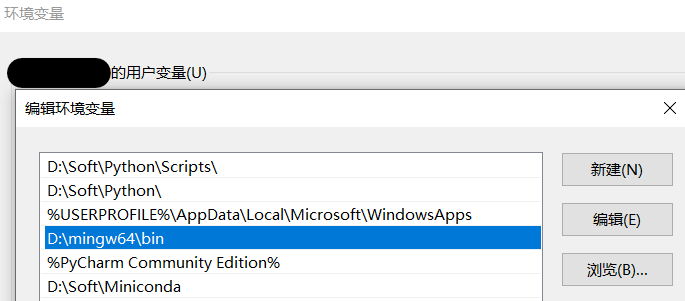
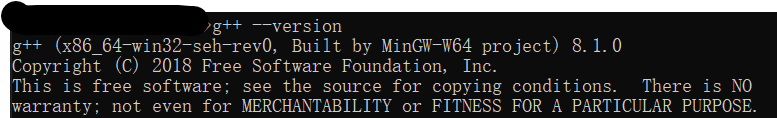
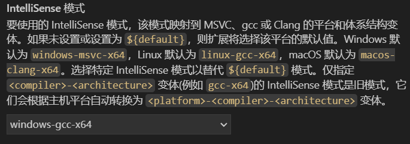
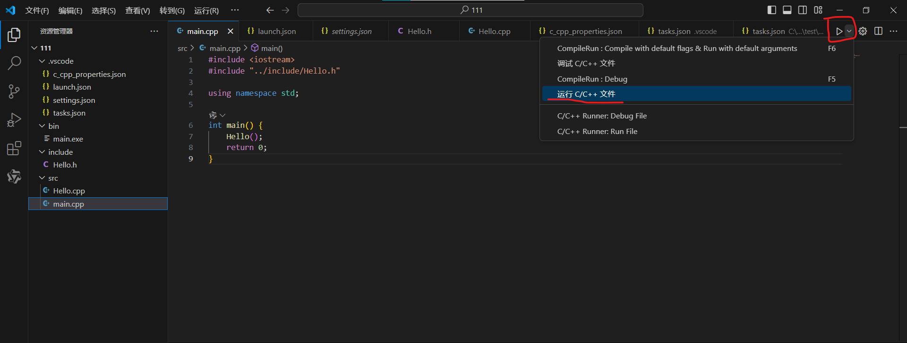

<!-- ## 目录 -->

## 安装基本工具

### 安装VSCode

前往 [VSCode](https://code.visualstudio.com/) 的官网下载对应的版本并安装。

### 安装C++编译器

这里推荐使用 **MinGW64** 作为C++编译器，可以点击 [这里](https://github.com/niXman/mingw-builds-binaries/releases/download/14.2.0-rt_v12-rev0/x86_64-14.2.0-release-win32-seh-ucrt-rt_v12-rev0.7z) 下载。  
解压后得到一个名称为`mingw64`的文件夹，大小约665MB，将这个文件夹放置在一个你可以找到的目录下，并添加到环境变量中。

配置环境变量时只需要将`\mingw64\bin`的路径添加到用户变量的 `PATH`即可，如下图所示。


这是打开cmd，输入`g++ --version`，如果输出如下所示，即为配置正确。


### 安装VSCode插件

打开VSCode，点击左下角的扩展图标，搜索并安装以下插件：
* `C/C++` 用于配置C++相关参数
* `CodeLLDB` 调试依赖插件
* `Chinese (Simplified)` 汉化，可选
* `TONGYI Lingma` 可选，提高效率神器

:::note[注意]
插件安装完成后，需要重启VSCode。
:::


## 配置VSCode环境

打开VSCode，在上方的搜索栏搜索`>C/C++`，并选择编辑配置。

再出现的配置环境界面中，编译器路径选择自己之前放置MinGW64文件夹的路径。

IntelliSense模式选择`windows-gcc-x64`。

C++标准可以自己根据需求设置，这里设置的是`c++17`。

## 编写代码

配置完环境后，新建一个文件夹作为C++项目，一个项目通常包含以下几个部分：
* `src`文件夹：存放源代码文件
* `include`文件夹：存放头文件
* `bin`文件夹：存放编译后的可执行文件
所以在项目文件夹里面再新建3个如上名称的文件夹。
此时我们来到`src`文件夹下，新建一个`main.cpp`文件，输入测试代码：
~~~c++
#include <iostream>

using namespace std;

int main() {
    cout << "Hello World!" << endl;
    return 0;
}
~~~

此时点击右上角的三角形调试按钮，选择`运行C/C++文件`,在弹出的窗口选择`g++`编译器。


此时，会默认生成一个名称为`.vscode`的文件夹，里面有四个文件，分别是`c_cpp_properties.json`和`tasks.json`。

修改`c_cpp_properties.json`文件，在`includePath`中添`include`文件夹所在路径，如下所示。
```json
//c_cpp_properties.json
"includePath": [
    "${workspaceFolder}/**",
    "${workspaceFolder}/include/**"
]
```
修改`tasks.json`文件，将`args`中配置修改为如下代码。
```json
//tasks.json
"args": [
    "-fdiagnostics-color=always",
    "-g",
    "${fileDirname}\\*.cpp",
    "-o",
    "${fileDirname}\\..\\bin\\${fileBasenameNoExtension}.exe"
]
```

此时再去调试就会在下方终端处显示结果，并在`bin`文件夹下生成一个可执行文件。

## 自定义头文件
如果需要自定义头文件，需要将`.h`放在include文件夹下，`.cpp`文件放在src文件夹下。
引用头文件采用相对路径，代码如下所示所示。
```c++
#include "../include/test.h"
```


